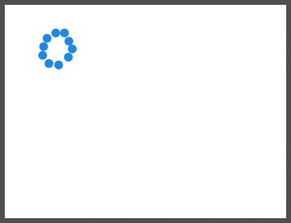
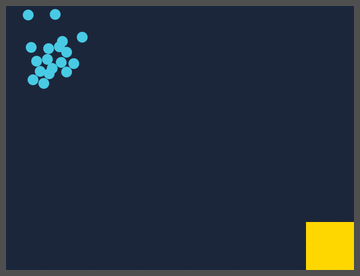
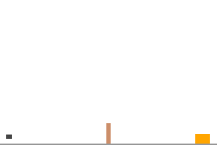
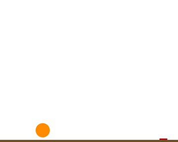
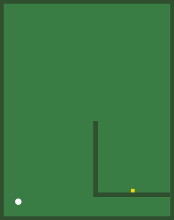
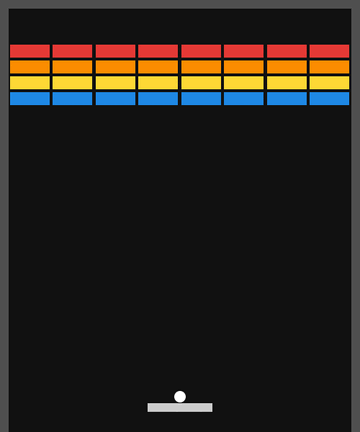
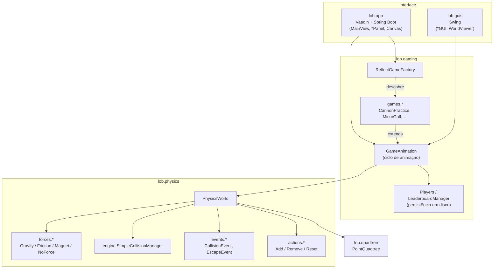

# Lots of Balls 🎱

> Motor de física 2D escrito de raiz em Java e uma coleção de seis mini-jogos jogáveis no browser, com Spring Boot + Vaadin.


Trabalho prático 3 da unidade curricular **ASW** — Licenciatura em Ciência de Computadores, Faculdade de Ciências da Universidade do Porto (2025/26).

<p align="center">
  
  
</p>

---

## Índice

- [Sobre o projeto](#sobre-o-projeto)
- [Os jogos](#os-jogos)
- [Arquitetura](#arquitetura)
- [Padrões de desenho](#padrões-de-desenho)
- [Como executar](#como-executar)
- [Estrutura do repositório](#estrutura-do-repositório)
- [Créditos](#créditos)

## Sobre o projeto

O **Lots of Balls** é composto por três camadas:

1. **Motor de física 2D** (`lob.physics`): integra o movimento sob forças configuráveis (gravidade, atrito, magnetismo), deteta e resolve colisões círculo/círculo, círculo/retângulo e retângulo/retângulo, e emite eventos de colisão e de saída do mundo.
2. **Índice espacial** (`lob.quadtree`): uma *point quadtree* genérica que guarda as formas por posição para acelerar as consultas de colisão.
3. **Camada de jogo** (`lob.gaming`): classe base com o ciclo de animação, registo persistente de jogadores, *leaderboard* e uma *factory* que descobre os jogos por reflexão.

Por cima destas camadas existem duas interfaces gráficas:

- **Aplicação web** (`lob.app`): Spring Boot + Vaadin, com *layout* de navbar e *drawer*, gestão de jogadores, *leaderboard* por jogo e animação enviada do servidor para um `<canvas>` HTML5 via *server push*.
- **Lançadores desktop** (`lob.guis`): janelas Swing para correr os jogos originais sem servidor.

## Os jogos

| | Jogo | Força | Como se joga | Pontuação |
|:-:|---|---|---|---|
|  | **Cannon Practice** | Gravidade | Clica para disparar o canhão na direção do clique e acerta no alvo atrás do muro. | Acertos acumulados |
|  | **Dribbling Master** | Gravidade + amortecimento | Clica perto da bola de basquete para lhe dar um impulso e fá-la quicar até ao alvo à direita. | 100 ao acertar |
|  | **Micro Golf** | Atrito | Clica para dar uma tacada na direção do clique. Contorna o obstáculo em L até ao buraco. | `100 − 10 × (tacadas − 1)` |
|  | **Arkanoid Knockoff** | Nenhuma (inércia) | Move o rato para controlar a raquete e clica para lançar a bola. Parte todos os tijolos. | Tijolos partidos |
|  | **Ball Storm** ⭐ | Gravidade | Cada clique lança uma rajada de bolas em direções aleatórias. É um teste de esforço ao motor com centenas de bolas a colidir. | Bolas lançadas |
|  | **Magnet** ⭐ | Magnetismo | O íman segue o cursor e as bolas seguem o íman. Leva o enxame até ao alvo dourado. | Bolas entregues |

⭐ Jogos extra criados como valorização do trabalho. Usam uma `ForceStrategy` nova (`MagnetStrategy`) e são descobertos automaticamente pela `ReflectGameFactory`, sem alterar código de descoberta.

> As animações acima foram geradas diretamente a partir do motor de física com o renderizador Swing do projeto.

## Arquitetura



**Ciclo de cada frame:**

1. `GameAnimation` chama `step()` no jogo concreto (à taxa de FPS configurada, 60 na versão web).
2. O `PhysicsWorld` pede a aceleração à `ForceStrategy` e integra a posição e a velocidade de cada forma.
3. O `CollisionManager` deteta as sobreposições (calculando o *manifold* com a normal e a penetração), repõe as posições, rebate as velocidades com o coeficiente de restituição e notifica os observadores.
4. Os jogos reagem aos eventos (por exemplo, remover um tijolo) através de comandos diferidos, aplicados no fim do ciclo.
5. O *frame* (a lista de formas) é enviado ao `FrameShower`, que o desenha no `<canvas>` (web) ou no `Canvas` AWT (Swing).

## Padrões de desenho

| Padrão | Onde | Para quê |
|---|---|---|
| **Strategy** | `ForceStrategy` → `GravityStrategy`, `FrictionStrategy`, `MagnetStrategy`, `NoForceStrategy`; `CollisionManager` | Cada jogo troca a física sem mexer no motor. `NoForceStrategy` funciona como *null object*. |
| **Observer** | `PhysicsSubject` / `PhysicsObserver` / `PhysicsEvent` | Os jogos subscrevem eventos de colisão e de saída do mundo com *lambdas*. |
| **Command** | `ActionOnShapes`, `PendingActions`, `Add/Remove/ResetAction` | Alterações ao mundo durante a iteração ficam em fila, o que evita `ConcurrentModificationException`. |
| **Composite** | `Trie` → `LeafTrie` / `NodeTrie` | Nós da *quadtree*: folhas guardam pontos e nós internos delegam em 4 quadrantes. |
| **Façade** | `PointQuadtree` | Expõe uma API simples (inserir, procurar, remover, consulta por região, iterar) por cima da estrutura recursiva. |
| **Template Method** | `GameAnimation` | Define o ciclo de animação. Os jogos só implementam `resetGame()` e `step()`. |
| **Factory Method** | `AppearanceFactory` | O motor só conhece nomes lógicos (`"ball"`, `"wall"`) e cada interface decide como desenhá-los. |
| **Factory + Reflection** | `ReflectGameFactory` | Descobre e instancia todas as subclasses de `GameAnimation` em `lob.gaming.games`. |
| **Singleton** | `Players`, `LeaderboardManager` | Registos únicos com persistência por serialização Java. |

Outros detalhes de implementação:

- `Shape` é uma interface **`sealed`** restrita a `Circle` e `Rectangle`.
- `Vector2D`, `Circle` e os eventos são **`record`s** imutáveis.
- O eixo *y* cresce para baixo (convenção de ecrã).

## Como executar

### Requisitos

- **JDK 21**
- Maven (ou o *wrapper* `mvnw` incluído)
- Acesso à internet no primeiro *build*, para o Maven e o Vaadin descarregarem as dependências e o Node.js

### Aplicação web (Vaadin)

```bash
./mvnw spring-boot:run          # Linux / macOS
mvnw.cmd spring-boot:run        # Windows
```

A aplicação abre em **http://localhost:8080**. Para começar:

1. Clica em **Jogador** para registar ou entrar com um jogador.
2. Escolhe um jogo no menu lateral.
3. Consulta as melhores pontuações em **Leaderboard**.

Os jogadores e as pontuações ficam guardados em `players.dat` e `leaderboard.dat` na diretoria de execução.

Para gerar um JAR de produção:

```bash
./mvnw clean package
java -jar target/spring-skeleton-1.0-SNAPSHOT.jar
```

### Versões desktop (Swing)

Os quatro jogos originais têm lançadores Swing que não precisam do servidor. Os pacotes `lob.physics`, `lob.quadtree`, `lob.gaming` e `lob.guis` não dependem de bibliotecas externas:

```bash
mkdir -p out
javac -d out $(find src/main/java/lob -name '*.java' -not -path '*/app/*')
java -cp out lob.guis.CannonPracticeGUI      # ou MicroGolfGUI, DribblingMasterGUI, ArkanoidKnockoffGUI
```

Também podes correr qualquer classe `*GUI` diretamente a partir do IntelliJ ou do Eclipse.

### Adicionar um jogo novo

1. Cria uma subclasse de `GameAnimation` em `lob.gaming.games`, com construtor sem argumentos e um campo `public static final String GAME_NAME`.
2. Implementa `resetGame()` (montar o mundo e escolher a `ForceStrategy`) e `step()` (regras do jogo).
3. Cria um `*Panel` em `lob.app.games` que estenda `GenericGamePanel`, com `@Route(layout = MainView.class)` e um método `getAppearanceColors()`.

O jogo aparece automaticamente na página inicial, através da `ReflectGameFactory`.

## Estrutura do repositório

```
src/main/java/lob/
├── app/                 # Aplicação web (Vaadin + Spring Boot)
│   ├── Application.java     # ponto de entrada (@Push, persistência, FPS)
│   ├── MainView.java        # AppLayout: navbar + drawer
│   ├── WelcomePanel.java    # página inicial (lista de jogos por reflexão)
│   ├── LeaderboardPanel.java
│   ├── PlayerDialog.java    # registo / login de jogadores
│   ├── Canvas.java          # binding para <canvas> HTML5
│   ├── WorldViewer.java     # desenha os frames no canvas
│   ├── GenericGamePanel.java
│   └── games/               # um *Panel por jogo
├── gaming/              # Lógica de jogo
│   ├── GameAnimation.java   # Template Method: ciclo de animação
│   ├── ReflectGameFactory.java
│   ├── Players.java / Player.java
│   ├── LeaderboardManager.java
│   └── games/               # os 6 jogos
├── physics/             # Motor de física 2D
│   ├── Vector2D.java
│   ├── engine/              # PhysicsWorld, CollisionManager, manifold
│   ├── forces/              # Gravity, Friction, Magnet, NoForce
│   ├── shapes/              # Circle, Rectangle (sealed Shape)
│   ├── events/              # Observer: CollisionEvent, EscapeEvent
│   └── actions/             # Command: Add/Remove/Reset
├── quadtree/            # PointQuadtree (Composite)
└── guis/                # Lançadores Swing
```

## Créditos

- **Cauã Pinheiro Souza**, com o grupo 12 de ASW 2025/26.
- O esqueleto Spring Boot/Vaadin e as classes de suporte `Canvas`, `WorldViewer` e `GenericGamePanel` (na versão original) foram fornecidos pela equipa docente (Prof. José Paulo Leal).
